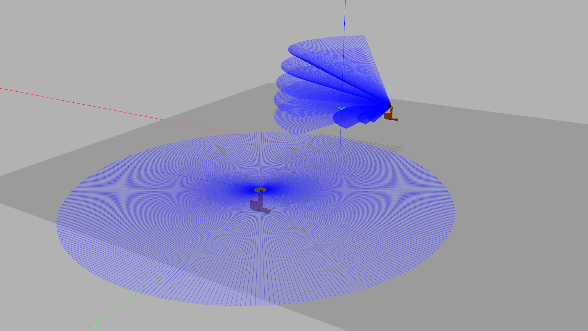
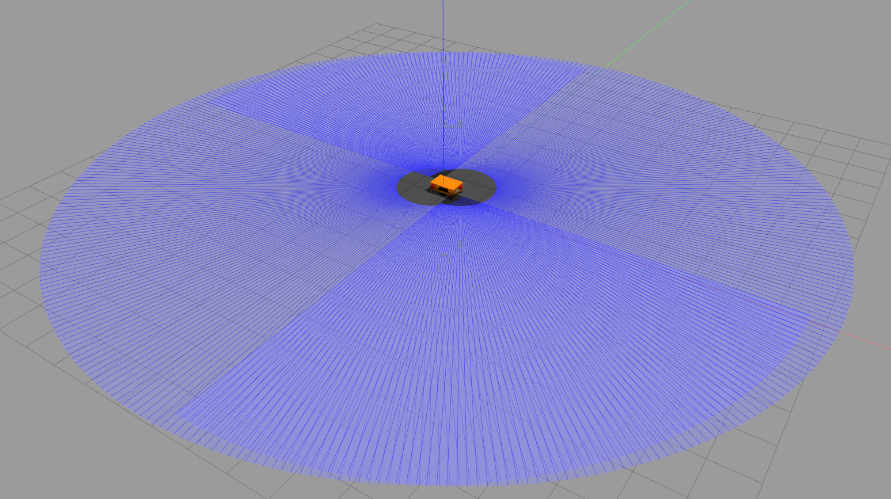
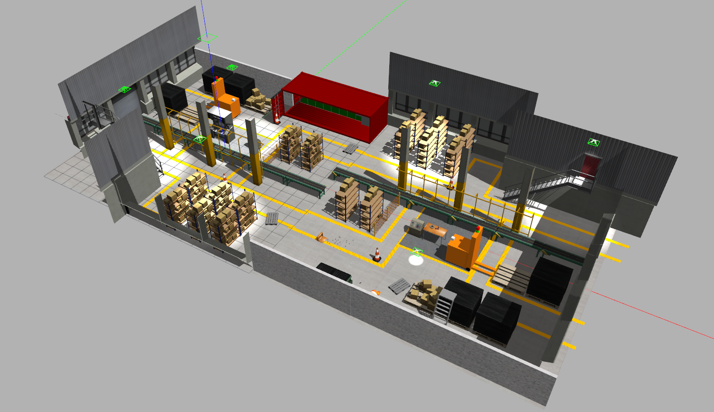

# FactoryBot (ROS 2 Humble Port)
This repository provides ROS 2 compatible URDFs and Gazebo simulation environments for AGVs and AMRs in warehouse environments. It has been upgraded to support ROS 2 Humble and Gazebo Classic.

## Assets
This repo includes urdf files for AGV and AMR, equipped with lidars and cameras.



This package also includes Gazebo worlds representing factory environments:


# Procedure to use the package

## 1. System Requirements
- **OS:** Ubuntu 22.04
- **ROS 2:** Humble Hawksbill
- **Simulation:** Gazebo Classic (11.x) with `gazebo_ros_pkgs`

## 2. Install ROS 2 Dependencies & Gazebo Models
Gazebo Classic requires standard models to be cached locally to prevent it from freezing on startup.

```bash
sudo apt update
sudo apt install ros-humble-gazebo-ros-pkgs ros-humble-xacro

# Download standard Gazebo models to prevent freezing
mkdir -p ~/.gazebo
git clone https://github.com/osrf/gazebo_models.git ~/.gazebo/models
```

## 3. Build the Workspace
Clone this repository into your ROS 2 workspace (e.g., `~/robot_ws/src`), then build using `colcon`:
```bash
cd ~/robot_ws
colcon build
source install/setup.bash
```

## 4. Launching the Robot in Gazebo
With the package built natively in ROS 2, you can now launch the robots directly. **Important:** You must tell Gazebo where to find the custom factory models to prevent it from hanging!

```bash
# Terminal 1: Start Gazebo
export GAZEBO_MODEL_PATH=$GAZEBO_MODEL_PATH:~/robot_ws/src/factorybot/warehouse/models
ros2 launch gazebo_ros gazebo.launch.py world:=$(ros2 pkg prefix factorybot --share)/warehouse/factory.world

# Terminal 2: Spawn the AMR
xacro $(ros2 pkg prefix factorybot --share)/robot/amr.urdf.xacro robot_name:=amr_1 > /tmp/amr_1.urdf
ros2 run gazebo_ros spawn_entity.py -entity amr_1 -file /tmp/amr_1.urdf -x 0 -y 0 -z 0.1
```

## Note on Legacy Nodes
The legacy ROS 1 `catkin` C++ nodes (ball_chaser, amcl mapping, etc.) have been deprecated in favor of the new **Singular Brain** ROS 2 centralized architecture. This package now serves primarily to provide the ROS 2 simulation assets and URDF models.